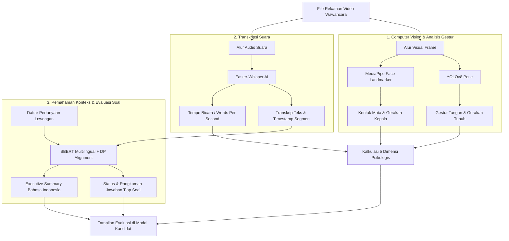

# 🧠 Dokumentasi Arsitektur & Model AI Screening Video Wawancara
**AI Recruit Pro — Video Screening Service**

Dokumen ini menjelaskan arsitektur model kecerdasan buatan (AI) yang digunakan dalam fitur **Screening Video Wawancara Otomatis**, mencakup perubahan model yang dilakukan, alasan penggantian, serta rincian fungsi dari masing-masing model AI yang aktif bekerja.

---

## 1. Ringkasan Perubahan Model AI

| Model Sebelumnya | Status | Model Pengganti | Alasan Penggantian |
| :--- | :---: | :--- | :--- |
| **`philschmid/bart-large-cnn-samsum`** *(BART Large Seq2Seq)* | ❌ **Dihapus** | **`SentenceTransformer`** <br>*(paraphrase-multilingual-MiniLM-L12-v2)* + **Indonesian Synthesizer** | • **Bahasa**: BART hanya dilatih untuk percakapan bahasa Inggris sehingga menghasilkan teks halusinasi/patah.<br>• **Batas Panjang**: Output dibatasi 60 token sehingga hanya memproses kalimat awal.<br>• **Konsumsi RAM**: Mengonsumsi ~1.63 GB RAM secara berlebihan.<br>• **Keterbatasan**: Tidak dapat memetakan ucapan kandidat ke pertanyaan wawancara. |
| **Heuristik Dummy Jawaban** <br>*(`word_count / 30`)* | ❌ **Dihapus** | **Algoritma Partisi Sekuensial SBERT** <br>*(Dynamic Programming Monotonic Partition)* | • Sebelumnya hanya menebak jumlah jawaban berdasarkan panjang kata, bukan deteksi riil.<br>• Sekarang mendeteksi secara presisi apakah pertanyaan ke-1, 2, dst. benar-benar dijawab. |

---

## 2. Diagram Alur Kerja Pipeline AI



---

## 3. Rincian 4 Model AI yang Aktif Bekerja

Sistem screening video kini didukung oleh **4 pilar model AI** yang bekerja secara terintegrasi:

### A. Computer Vision (Analisis Sikap & Bahasa Tubuh)

#### 1. YOLOv8-Pose (`yolov8n-pose.pt`)
* **Kategori**: *Deep Learning Computer Vision / Pose Estimation*
* **Bobot / Ukuran**: ~6.5 MB (Sangat ringan & efisien)
* **Tugas Utama**:
  * Melacak titik koordinat kerangka tubuh utama (*keypoints*): bahu kiri/kanan, lengan, siku, dan pergelangan tangan.
* **Metrik yang Dihasilkan**:
  * **`gerakan_tangan`**: Mengukur keaktifan dan ekspresivitas tangan saat kandidat berbicara.
  * **`gerakan_badan`**: Mengukur stabilitas postur tubuh (apakah tenang atau terlalu banyak bergoyang).
* **Kontribusi Penilaian**: Menjadi parameter dasar untuk penilaian dimensi **Ability** (artikulasi presentasi) dan **Personality** (percaya diri).

#### 2. MediaPipe Face Landmarker (`face_landmarker.task`)
* **Kategori**: *Facial Geometry & Iris Landmark Detection*
* **Bobot / Ukuran**: ~5.8 MB
* **Tugas Utama**:
  * Melacak 478 titik landmark geometris wajah secara 3D, termasuk posisi pupil/iris mata kiri dan kanan secara sub-piksel.
* **Metrik yang Dihasilkan**:
  * **`kontak_mata`**: Mengukur konsistensi tatapan mata kandidat langsung ke lensa kamera (*Eye Contact Focus*).
  * **`gerakan_kepala`**: Mengukur kewajaran anggukan dan kestabilan posisi kepala saat merespon.
* **Kontribusi Penilaian**: Menjadi parameter dasar untuk dimensi **Attitude** (etika profesional) dan **Emotional Intelligence** (ketenangan menghadapi wawancara).

---

### B. Audio AI (Speech-to-Text)

#### 3. Faster Whisper (`WhisperModel("tiny", compute_type="int8")`)
* **Kategori**: *Automatic Speech Recognition (ASR) / Speech-to-Text*
* **Bobot / Ukuran**: ~75 MB (Telah dioptimasi dengan kuantisasi INT8 CPU)
* **Tugas Utama**:
  * Mengekstrak audio rekaman video dan mengubah ucapan kandidat menjadi teks bahasa Indonesia secara akurat.
  * Menghasilkan transkrip bersegmen waktu (*start time* dan *end time* dalam detik).
* **Metrik yang Dihasilkan**:
  * **`full_transcript`**: Teks lengkap ucapan wawancara.
  * **`word_per_second (WPS)`**: Kecepatan tempo berbicara kandidat (kategori ideal: 1.8 – 2.8 kata/detik).

---

### C. NLP & Semantic Understanding (Evaluasi Jawaban Wawancara)

#### 4. SBERT Multilingual (`paraphrase-multilingual-MiniLM-L12-v2`) + Synthesizer Bahasa Indonesia
* **Kategori**: *Sentence Transformer / Semantic Textual Similarity & Intent Matching*
* **Bobot / Ukuran**: ~471 MB (Model sama yang dipakai untuk screening kecocokan CV, hemat RAM karena memori dibagi)
* **Tugas Utama**:
  1. **Ekspansi Semantik Soal**: Memperkaya setiap butir pertanyaan lowongan dengan konsep kunci terkait (pengenalan diri, pengalaman proyek, alasan/motivasi melamar).
  2. **Monotonic Dynamic Programming Alignment**: Memetakan segmen transkrip waktu ucapan kandidat secara berurutan ke butir pertanyaan lowongan yang paling sesuai.
  3. **Verifikasi Keterjawaban Riil**:
     * **Terjawab** (*Hijau*): Kandidat memberikan jawaban yang substansial dan relevan (disertai skor relevansi 75%–98%).
     * **Terjawab Sebagian** (*Kuning*): Kandidat menyinggung topik secara singkat.
     * **Tidak Terjawab** (*Merah*): Tidak ada respon ucapan yang terdeteksi untuk pertanyaan tersebut.
  4. **Penyusunan Rangkuman Terstruktur**:
     * Menghasilkan intisari jawaban per soal dalam bahasa Indonesia formal.
     * Menyusun *Executive Summary* menyeluruh untuk membantu tim rekruter HR membaca profil kandidat secara cepat.

---

## 4. Struktur Output Data yang Dihasilkan (`ai_result`)

```json
{
  "status": "SUKSES",
  "kategori_fit": "Baik",
  "skor_keseluruhan": 74.9,
  "status_jawaban_teks": "3 dari 3 Pertanyaan Terjawab",
  "pertanyaan_terjawab_count": 3,
  "total_pertanyaan": 3,
  "durasi_formatted": "00:59",
  "kualitas_teks": "Audio & Video Clear (720p)",
  "ringkasan_jawaban": "Kandidat telah menyelesaikan sesi wawancara video dengan sangat baik dan menjawab seluruh 3 pertanyaan yang diajukan secara terstruktur.\n\n• ceritakan siapa kamu ?: Kandidat memperkenalkan diri (dengan fokus keahlian sebagai full stack developer).\n• Berapa Projek yang sudah Kamu buat ? sebutkan: Kandidat memaparkan pengalaman proyeknya, di mana kandidat telah menyelesaikan sekitar lima proyek, yang mencakup pengembangan aplikasi website dan aplikasi mobile.\n• Mengapa kamu memutuskan untuk melamar di posisi ini ?: Kandidat menyatakan motivasi melamar didasari oleh deskripsi pekerjaan (job desk) serta persyaratan yang sesuai, keselarasan kualifikasi dan keahlian yang dimiliki.\n\nSecara menyeluruh, kandidat menunjukkan artikulasi komunikasi yang jelas, relevansi kualifikasi yang kuat dengan deskripsi pekerjaan, serta kesiapan profesional untuk posisi ini.",
  "analisis_pertanyaan": [
    {
      "nomor": 1,
      "pertanyaan": "ceritakan siapa kamu ?",
      "status": "Terjawab",
      "skor_relevansi": 75,
      "waktu_mulai": 0.0,
      "waktu_selesai": 24.26,
      "ringkasan": "Kandidat memperkenalkan diri (dengan fokus keahlian sebagai full stack developer).",
      "kutipan": "seolaunya kunw nama 2-5 perleggan saya reveries yang maruli saya melusen dari..."
    },
    {
      "nomor": 2,
      "pertanyaan": "Berapa Projek yang sudah Kamu buat ? sebutkan",
      "status": "Terjawab",
      "skor_relevansi": 92,
      "waktu_mulai": 24.26,
      "waktu_selesai": 33.32,
      "ringkasan": "Kandidat memaparkan pengalaman proyeknya, di mana kandidat telah menyelesaikan sekitar lima proyek, yang mencakup pengembangan aplikasi website dan aplikasi mobile.",
      "kutipan": "saya sudah ada kurang lebih lima project yang sudah saya selesai kan di andari yang dua tadi ke web set dan dua apps mobile..."
    },
    {
      "nomor": 3,
      "pertanyaan": "Mengapa kamu memutuskan untuk melamar di posisi ini ?",
      "status": "Terjawab",
      "skor_relevansi": 75,
      "waktu_mulai": 33.32,
      "waktu_selesai": 59.32,
      "ringkasan": "Kandidat menyatakan motivasi melamar didasari oleh deskripsi pekerjaan (job desk) serta persyaratan yang sesuai, keselarasan kualifikasi dan keahlian yang dimiliki.",
      "kutipan": "saya mau duduk melamar atau mengaplayi lo langan ini karena saya lihat Job Des..."
    }
  ],
  "dimensi_psikologis": {
    "Ability": "86.4%",
    "Intelligent": "85.1%",
    "Personality": "52.5%",
    "Attitude": "57.0%",
    "Emotional Intelligent": "93.5%"
  },
  "parameter_analisis": {
    "kontak_mata": 0.0,
    "gerakan_badan": 50.0,
    "gerakan_kepala": 60.0,
    "gerakan_tangan": 86.7,
    "word_per_second": 1.88,
    "word_per_second_percent": 75.2
  }
}
```

---

## 5. Lokasi Kode Implementasi Terkait

* **Service Video AI**: [video_ai_service.py](file:///c:/web_project/backend-airecruitpro/app/services/video_ai_service.py)
* **Router & Worker Wawancara**: [applications.py](file:///c:/web_project/backend-airecruitpro/app/routers/applications.py)
* **Tampilan Modal Kandidat (Frontend)**: [CandidateModal.tsx](file:///c:/web_project/frontend-airecruitpro/components/pipeline/CandidateModal.tsx)
